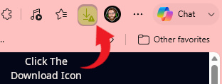
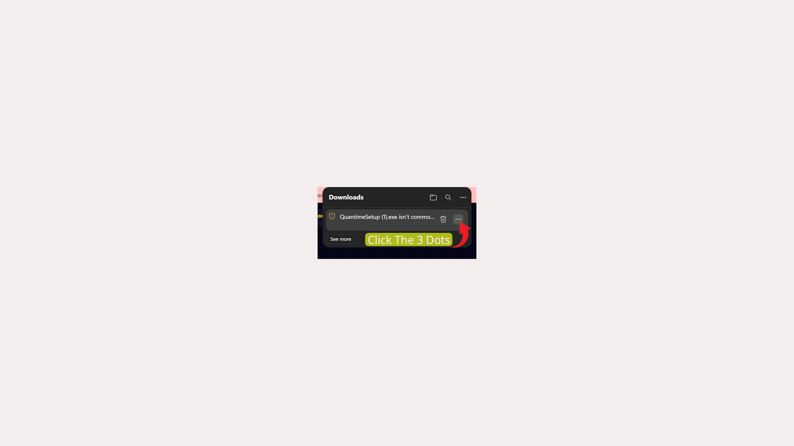
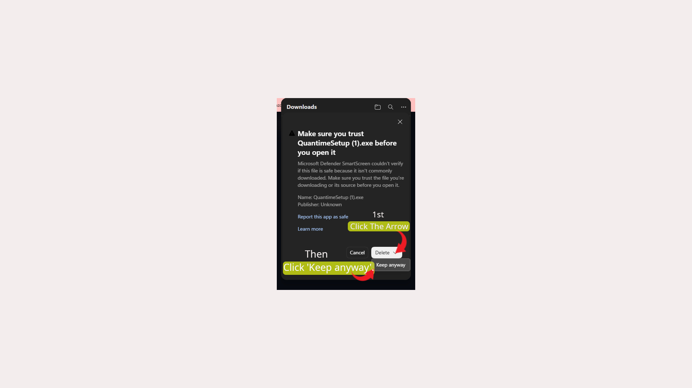
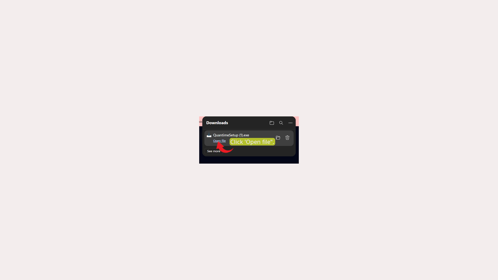
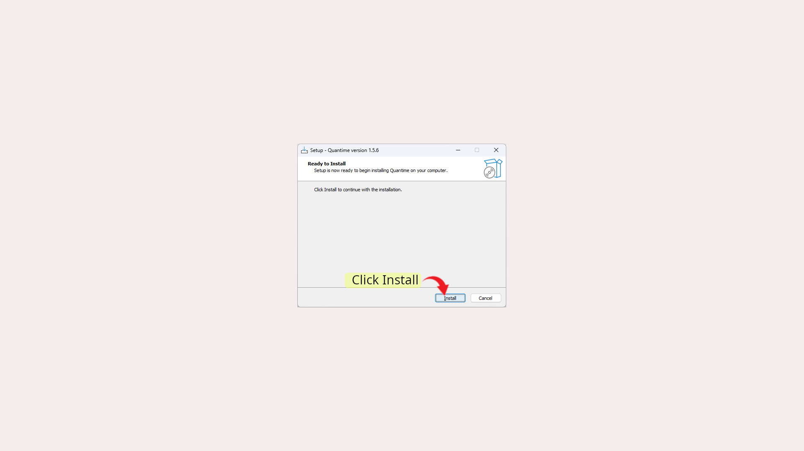

<p align="center">
  
</p>

# Quantime

Quantime is a local-first, privacy-respecting intelligent scheduling engine and task manager. By combining a local reasoning LLM (run via Ollama) with Google Workspace APIs (Calendar and Gmail), Quantime automatically syncs, schedules, and resolves timeline dependencies right on your desktop, and syncs seamlessly with your mobile device.

---

## Key Features

*   **Intelligent Local Scheduling Agent**: Powered by custom agentic system prompts on models like **Gemma 4 (12B)** or **Gemma 2 (9B)** running locally via Ollama with an expanded 8,192 token context window.
*   **Semantic RAG Memory**: Uses an embedded **Chroma Vector Database** alongside SQLite to store, search, and recall user habits, scheduling preferences, and task histories.
*   **Real-time Voice Chat**: Speaks back using the high-performance local **Kokoro Text-to-Speech (TTS)** engine. Listens using local **SpeechRecognition (STT)** and intelligent **Silero Voice Activity Detection (VAD)** to allow fluid, natural vocal interrupts.
*   **Sound Push Notifications**: Reminds you of upcoming scheduled blocks or focus sessions using Web Push standards (`pywebpush`) with customizable lead-time chimes.
*   **Task Dependency & Routine Engine**: Resolves complex task relationships (e.g., *Task B* depends on *Task A*) and handles recurring routines automatically.
*   **Bi-Directional Google Sync**: Fully integrates with Google Calendar and Gmail to sync scheduled events, stage scheduling proposals, and summarize relevant emails.
*   **Cross-Device Mobile PWA**: Access your dashboard securely on the go via a secure LocalTunnel bridge without exposing your database to the public cloud.

---

## Quick Start: How to Download & Install (For Everyone)

Quantime is designed to be zero-config and beginner-friendly. You do **not** need to install programming tools or set up developer accounts.

1.  **Download**: Go to the [Releases](https://github.com/RorriMaesu/Quantime/releases) page on our GitHub repository and download the latest `QuantimeSetup.exe` installer.
2.  **Install**: Run `QuantimeSetup.exe` on your Windows PC. The installer will automatically:
    *   Check for and silently install **Ollama**.
    *   Initialize portable, isolated local Python 3.10 and Node.js runtimes.
    *   Download local LLM weights and compile the scheduling model based on your system VRAM.
    *   Configure Windows Task Scheduler to start the service silently in the background on boot.
    *   Create desktop and start menu shortcuts with our Möbius Q branding.
3.  **Launch**: Click the desktop icon. Your default browser will open the Quantime PWA Dashboard (`http://localhost:5173`).

### Visual Download & Installation Steps

If your browser blocks the download or shows a warning due to a missing publisher signature, follow these steps to keep and run the file:

#### Step 1: Click the download icon in your browser history or toolbar.


#### Step 2: Hover over the downloaded file and click the three dots menu button (...).


#### Step 3: Choose "Keep" or "Keep anyway" to verify you trust the software.


#### Step 4: Click "Open file" once the download finishes.


#### Step 5: Click "Run" or "Install" inside the installation wizard.


---

## Connecting Google Workspace

Quantime supports two sync modes: **Proxy Mode** (Default / Single-Click) and **Direct Mode** (Advanced / Private).

### Option A: Single-Click Sign-In (Default)
1.  Open the settings popover in the top-right corner of the dashboard.
2.  Click **Link Google Account**.
3.  Sign in with your personal Google account.
4.  The system will authorize and immediately sync your next 7 days of calendar events.

### Option B: Custom OAuth Credentials (Advanced / Private)
If you prefer to bypass our centralized helper and use your own private Google Cloud project:
1.  Open [Google Cloud Console](https://console.cloud.google.com/) and create a project.
2.  Navigate to **API & Services > Credentials > Create Credentials > OAuth client ID**. Set Application Type to **Web application** and add this Redirect URI:
    `http://localhost:8000/auth/callback`
3.  On the Quantime dashboard, open **Settings > Custom OAuth Secrets**.
4.  Input your custom **Project ID**, **Client ID**, and **Client Secret**, and save.
5.  Click **Link Google Account** to authenticate directly via your credentials.

---

## Connecting Your Mobile Phone

To view your timeline and chats on the go:
1.  Open the dashboard on your PC, click the profile settings, and select **Connect Mobile Phone**.
2.  Copy the secure public gateway link (e.g., `https://quantime-scheduler-green.loca.lt`) and open it in your mobile browser.
3.  Input the displayed host PC public IP address to bypass the gateway reminder screen.
4.  Tap **Add to Home Screen** inside Chrome (Android) or Safari (iOS) to install the PWA with its native icon!

---

## Local Development (For Developers)

If you wish to clone the repository and run the codebase manually:

### Prerequisites
*   [Ollama for Windows](https://ollama.com/)
*   Python 3.10+
*   Node.js v18+

### Setup & Run
1.  Clone the repository:
    ```bash
    git clone https://github.com/RorriMaesu/Quantime.git
    cd Quantime
    ```
2.  Run the orchestration launcher script in PowerShell to bootstrap environment files, verify model compilation, install package dependencies, and spin up services:
    ```powershell
    powershell -ExecutionPolicy Bypass -File .\run_quantime.ps1
    ```
3.  Compile the installer yourself using [Inno Setup Compiler](https://jrsoftware.org/isinfo.php):
    ```cmd
    iscc.exe QuantimeSetup.iss
    ```

---

## System Architecture

```
                       +---------------------------------------+
                       |          React PWA Frontend           |
                       |       (Vite Server - Port 5173)       |
                       +---------------------------------------+
                                           |
                                           | REST & WebSockets (Sync)
                                           v
                       +---------------------------------------+
                       |            FastAPI Gateway            |
                       |              (Port 8000)              |
                       +---------------------------------------+
                           /               |               \
                          /                |                \
                         v                 v                 v
               +-------------------+  +----------+  +------------------+
               |    Ollama LLM     |  | SQLite   |  | Chroma Vector DB |
               |   (Port 11434)    |  | Database |  | (Semantic RAG)   |
               +-------------------+  +----------+  +------------------+
                        |                   |
                        v                   v
               +-------------------+  +----------+
               | Audio Processing  |  | Push     |
               | (Kokoro & Silero) |  | Webpush  |
               +-------------------+  +----------+
```

*   **SQLite Storage**: Uses Write-Ahead Logging (WAL) and busy locks to allow fast concurrent transactions between the agent processor and client sockets.
*   **Fernet Token Encryption**: Sync access tokens are encrypted before being written to disk using a unique Base64 key generated dynamically on first boot.
*   **Firestore Circuit Breaker**: Caps write commands to 5 per 10 seconds to protect free Spark tier daily operations if utilizing Firestore client sync.
